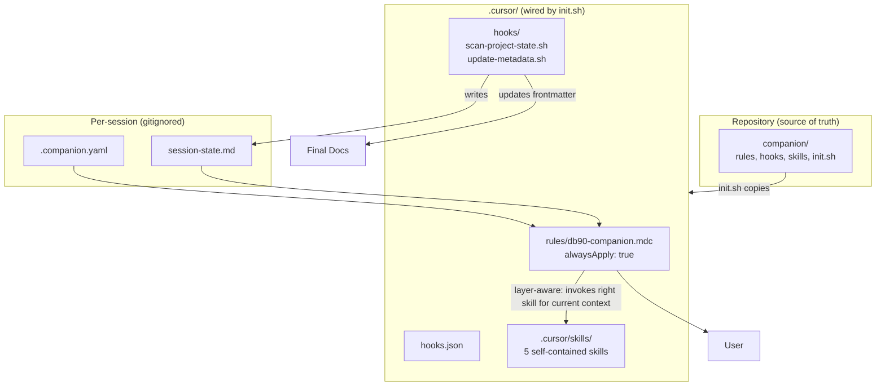

# DB90 Documentation Companion

## Core Idea

The `companion/` folder is the **source of truth** for the companion system. It lives in the repo alongside `layers/` — making this repository both the documentation template and the companion distribution package.

Running `companion/init.sh` once wires everything into Cursor (or any future editor). The script copies files to the right places; nothing requires manual setup.

## Architecture




## What Gets Built

### 1. `companion/` Folder — Source of Truth

All companion files live here before being installed. Committed to the repo, editor-agnostic, sharable.

```
companion/
├── README.md                              ← explains the system and init process
├── init.sh                                ← wires companion into Cursor
├── .companion.yaml.example                ← template for per-person config
├── rules/
│   └── db90-companion.mdc                 ← the brain
├── hooks.json                             ← hooks registration template
├── hooks/
│   ├── scan-project-state.sh              ← sessionStart hook
│   └── update-metadata.sh                 ← afterFileEdit hook
└── skills/
    ├── scan-project-state/SKILL.md        ← layer-agnostic
    └── session-handoff/SKILL.md           ← layer-agnostic
```

Layer-specific skills live with their layer:

```
layers/
├── layer-1-product/tools/
│   └── draft-feature-spec/SKILL.md
├── layer-2-design/tools/
│   └── draft-design-spec/SKILL.md
└── layer-3-architecture/tools/
    └── draft-technical-spec/SKILL.md
```

### 2. `companion/init.sh` — One-Time Setup

Copies companion files into Cursor's expected locations:

- `companion/rules/` → `.cursor/rules/`
- `companion/hooks/` → `.cursor/hooks/`
- `companion/hooks.json` → `.cursor/hooks.json`
- `companion/skills/` → `.cursor/skills/`
- `layers/layer-X/tools/draft-*/` → `.cursor/skills/` (all layer-specific skills)
- Creates `.companion.yaml` from `.companion.yaml.example` if not present
- Adds `.companion.yaml` and `.cursor/session-state.md` to `.gitignore`

Makes hook scripts executable. Idempotent — safe to re-run after updates.

### 3. Skills

**Layer-agnostic skills** live in `companion/skills/` — they belong to the companion system itself:
- `scan-project-state` — produces a project health summary on demand
- `session-handoff` — writes a resume packet when a session is ending or drifting

**Layer-specific skills** live in their respective `layers/layer-X/tools/` folder — they belong to the layer, not the companion. The companion rule is what's layer-aware: it reads the current document's frontmatter, determines which layer is being worked on, and invokes the appropriate skill. `init.sh` copies all of them into `.cursor/skills/` so Cursor can discover them.

### 4. Two Hooks

`**scan-project-state.sh**` (sessionStart)

- Scans all `final/` documents for frontmatter
- Builds a compact state summary and writes to `.cursor/session-state.md`
- Surfaces: `needs_review`, `needs_update`, `in_progress` docs; missing cross-layer docs; stale `last_updated` dates

`**update-metadata.sh**` (afterFileEdit, scoped to `layers/**/final/**/*.md`)

- Auto-updates `last_updated` to today's date
- Reads `relates_to` and sets `status: needs_review` on each downstream document
- Makes the cascade mechanism automatic — no manual owner notification needed

### 5. Companion Rule — `db90-companion.mdc`

`alwaysApply: true`. Encodes:

**Framework knowledge** — layers, owners, sequencing, doc types, frontmatter conventions, cascade model, refinement pipeline

**Three session modes:**

- **Resume** (session start): reads state file and config, surfaces what's unfinished, proposes a concrete focused scope
- **Guided** (during work): loads upstream docs from `relates_to`, enforces layer sequencing, invokes skills as needed
- **Handoff** (long/drifting session): summarizes decisions and open items, produces a resume packet for the next session

**Scope enforcement** — flags unrelated topics and suggests a new session

**Skill index** — lists all skills by path (companion-level and layer-specific) and when to invoke each

**Layer-aware context loading** — loads Layer N-1 finals before any Layer N drafting or review

### 6. `.companion.yaml` — Per-Person Config (gitignored)

```yaml
name: "Rafael Torre"
role: tech-lead  # pm | designer | tech-lead | developer | engagement-lead
```

Created from `.companion.yaml.example` by `init.sh`. Gitignored — follows the person, not the project.

## File Layout After `init.sh`

```
db90-layered-documentation/
├── companion/                         ← source of truth (committed)
├── layers/                            ← documentation templates (committed)
├── .cursor/                           ← wired by init.sh (partially gitignored)
│   ├── rules/db90-companion.mdc
│   ├── hooks.json
│   ├── hooks/
│   │   ├── scan-project-state.sh
│   │   └── update-metadata.sh
│   ├── session-state.md               ← gitignored
│   └── skills/
│       ├── scan-project-state/        ← from companion/skills/
│       ├── session-handoff/           ← from companion/skills/
│       ├── draft-feature-spec/        ← from layer-1-product/tools/
│       ├── draft-design-spec/         ← from layer-2-design/tools/
│       └── draft-technical-spec/      ← from layer-3-architecture/tools/
├── .companion.yaml                    ← gitignored
└── .companion.yaml.example            ← committed
```

## Build Order

1. `companion/` folder skeleton
2. `.companion.yaml.example` and config format
3. `scan-project-state.sh` hook
4. `update-metadata.sh` hook + `hooks.json` template
5. `db90-companion.mdc` rule
6. Companion-level skills (`scan-project-state`, `session-handoff`)
7. Layer-specific skills (`draft-feature-spec`, `draft-design-spec`, `draft-technical-spec`)
8. `init.sh`
9. `companion/README.md`
10. `.gitignore` updates

